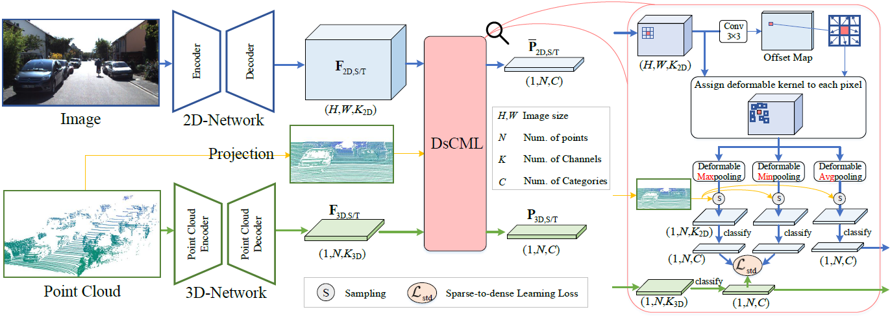

# Sparse-to-dense Feature Matching: Intra and Inter domain Cross-modal Learning in Domain Adaptation for 3D Semantic Segmentation
This is the code related to "Sparse-to-dense Feature Matching: Intra and Inter domain Cross-modal Learning in Domain Adaptation for 3D Semantic Segmentation" (ICCV 2021).

  

# Status
The paper and related code will be released soon.
